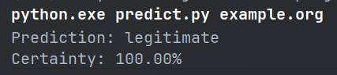

# Data Exploration & Modelling

Kindercarnavalsoptochtvoorbereidingswerkzaamhedencomitéleden

## Preperation

```bash
pip install -rU requirements.txt
```

## Table of content

### Data preprocessing

1. [Data Preparation](Notebooks/DataCleanup.ipynb)
2. [Feature engineering](Notebooks/Normalization.ipynb)
3. [Feature selection](Notebooks/Normalization.ipynb)
4. [Create useful visuals](Notebooks/Visualisations.ipynb)
5. [Hypothesis formulation](Notebooks/Mutual_information.ipynb)

### Model Evaluation & Hyperparameter Tuning

1. [Model evaluation](Notebooks/HyperParamater_Tuning.ipynb)
2. [Hyperparameter Tuning](Notebooks/HyperParamater_Tuning.ipynb)
3. [Model Selection](Notebooks/Model_Selection.ipynb)

## How to use the predictor?

### Install packages

Before using the predictor be sure that your python (venv) has the required packages installed. The required packages
can be found in the [requirements.txt](predictor/requirements.txt) file.

This can be done by moving to the predictor folder in your console

```bash
cd predictor
```

and running pip install -rU requirements.txt

```bash
pip install -rU requirements.txt
```

Without these required packages the predictor will not be able to predict the intends of the given URL.

### Run the predictor

The [predictor file](predictor/predict.py) can be run by moving to the predictor folder in your console

```bash
cd predictor
```

and executing the file using python.exe. The file expects one variable when being called (the url).

```bash
python.exe predict.py example.org
```

### How do I read the outcome?

When ran the predict file will return if it thinks the url is phishing or legitimate.
This is an example output the prediction file will give:



- The first line is the input you gave to the prediction file (running the file)
- The second line is what label the model thinks the url has.
- The last line is how certain the model is about this choice.

### Note

There are a couple of things to keep in account:

- The model can make errors. Even if the model says that the url is legitimate it can still be phishing.
- The longer url the more the url can look like phishing to the model.
- Some websites will use a string of numbers and letters as id's and use this in their URL's this can make the model
  think that it is a phishing link.